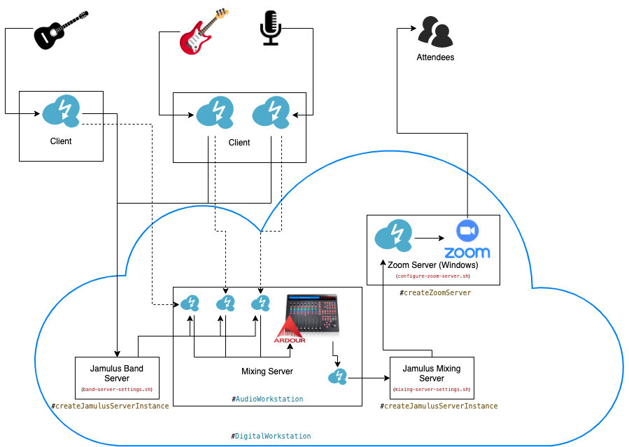
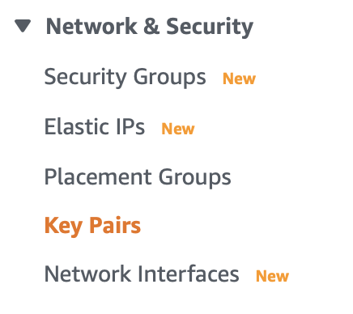

# aws-jamulus

Automatically sets up a Jamulus server and a Ardour mixing console on AWS using CDK. [Jamulus](https://jamulus.io) allows bands to do jam sessions in a remote environment. [Ardour](http://ardour.org) is a digital audio workstation which supports thousands of plugins to let your mix sound nice.

## Table of Content

- [Architecture](#architecture)
- [Getting Started - Prerequisites](#getting-started---prerequisites)
  - [Get the app and install dependencies](#get-the-app-and-install-dependencies)
  - [Prepare your AWS environment](#prepare-your-aws-environment)
  - [Setup your `config.json`](#setup-your-config.json)
- [Getting Started - Deploy your Jamulus environment](#getting-started---deploy-your-jamulus-environment)
  - [Destroy the environment](#destroy-the-environment)
- [Settings for your Jamulus environment](#settings-for-your-jamulus-environment)
- [Cost savings](#cost-savings)
- [Roadmap](#roadmap)

## Architecture

The basic architecture is shown in the image below. We setup a Jamulus Band Server in the AWS cloud which will be available through a defined IP address. In addition, it will set up another EC2 instance prepared for being a mixing console. A third EC2 instance will run the Jamulus Mixing Server which is used to present the mixing result to an audience. A forth server (Windows) runs a Jamulus client which connects to the Jamulus Mixing Server instance, and a Zoom client which connects to the Zoom meeting which the audience is listening to.

Every musician opens one Jamulus instance per instrument or microphone and associates the signal to one instance. The Jamulus instances connect to the Jamulus server. The mixing console opens one Jamulus instance per instrument or microphone and directs the signal to separate input channels on Ardour.

Ardour mixes the different instrument to create a nice and pleasant sound. The master will then be routed to the Jamulus Mixing Server. A presenter will feed this signal into a video conferencing tool like Zoom, so that attendees can listen to the music.



## Getting Started - Prerequisites 

### Get the app and install dependencies

Now, clone the git repository to your local machine (`my-aws-jamulus-folder` to
be the local folder where this repository will be copied into). These commands
require [nodeJs](https://nodejs.org/en/) to be installed:

```bash
git clone https://github.com/cabcookie/aws-jamulus.git my-aws-jamulus-folder
cd my-aws-jamulus-folder
# install all dependencies
npm install
```

### Prepare your AWS environment

If you haven't done already, setup [an AWS account](https://aws.amazon.com/de/premiumsupport/knowledge-center/create-and-activate-aws-account/),
protect it according to the [Security Best Practices](https://docs.aws.amazon.com/IAM/latest/UserGuide/best-practices.html)
and create an [Access Key for your CLI](https://docs.aws.amazon.com/IAM/latest/UserGuide/id_credentials_access-keys.html).

Let us first install the AWS command line tools and the Cloud Development Kit:

```bash
# this installs the packages global
sudo npm install -g aws-sdk
sudo npm install -g aws-cdk
```

In order to connect your machine with your AWS environment, run `aws configure`
in the command line and [follow the instructions in the documentation](https://docs.aws.amazon.com/cli/latest/userguide/cli-configure-quickstart.html). This will setup the
account and the region you will use in this environment.

You should be able to access your AWS Account and run commands via the CLI. The
following command should show you all users you have created during the setup
process:

```bash
aws iam list-users
```

If this command runs into issues, please review all steps in this section again.

As a last step, we need to create a PEM file to be able to securly access our
EC2 instances via a secure shell (SSH) or a remote desktop connection (RDP).
Create and download your key pair with the following command:

```bash
aws ec2 create-key-pair --key-name my-key-pair --query "KeyMaterial" --output text > my-key-pair.pem
```

This will create a key pair in the region you defined before. Your will find
your key pair in your AWS EC2 Console in the section Key Pairs:



When replacing `[region]` with the region you configured before
(e.g., eu-west-1), you will find your key pairs here:

`https://[region].console.aws.amazon.com/ec2/v2/home?region=[region]#KeyPairs:`

### Setup your `config.json`

As a last preparation step you need to create your config.json, according to the
example in `./bin/example-config.json`. So, copy the file to a file named
`./bin/config.json` and adjust the settings to your needs. Find more information
on these setting in the section [Settings for your Jamulus environment](#settings-for-your-jamulus-environment).

## Getting Started - Deploy your Jamulus environment

Now, that you have cloned the repository, installed all tools and dependencies,
set up your AWS environment, and have your key pair ready, you can deploy your
Jamulus environment.

As you do this the first time, you need to bootstrap your assets:

```bash
cdk bootstrap
```

You do not need to run this command later again.
Now, to deploy your environment, you just run:

```bash
cdk deploy
```

This will take a couple of minutes and it will let you know when its finished
by giving you the IP addresses for the 4 servers created by the CDK:

```bash
 ✅  DigitalWorkstation

Outputs:
DigitalWorkstation.JamulusBandServerPublicIp = 1.2.3.4
DigitalWorkstation.JamulusMixingServerPublicIp = 1.2.3.5
DigitalWorkstation.JamulusZoomServerPublicIp = 1.2.3.6
DigitalWorkstation.OnlineMixerMixingConsoleIpABCD = 1.2.3.7
```

When you have provided Elastic IPs (see below in [Settings for your Jamulus environment](#settings-for-your-jamulus-environment)),
these IP addresses will always be the same. Otherwise, those IP addresses will
change whenever you destroy one of the EC2 instances and create them again. This
happens whenever you [destroy the environment](#destroy-the-environment) or
whenever you change something in the settings or in the startup script and you
run `cdk deploy` again to implement the changes.

### Destroy the environment

When you do not need the environment again, you just run this command:

```bash
cdk destroy
```

This will destroy all servers and other resources created. 

## Settings for your Jamulus environment

TODO: to be documented as described in issue [#10](https://github.com/cabcookie/aws-jamulus/issues/10).


## Cost savings

TODO: to be documented as described in issue [#11](https://github.com/cabcookie/aws-jamulus/issues/11).

## Roadmap

In the following weeks we plan to:

1. Ensure installation of Ardour works silently
(see [#5](https://github.com/cabcookie/aws-jamulus/issues/5))
1. Ensure installation of Zoom and other Windows component work silently
(see [#12](https://github.com/cabcookie/aws-jamulus/issues/12))
1. Copy `jamulus-startup.sh` and its ini files to the online mixing instance
(see [#7](https://github.com/cabcookie/aws-jamulus/issues/7))
1. Create a Lambda which creates a simple AWS environment (S3 bucket)
(see [#3](https://github.com/cabcookie/aws-jamulus/issues/3))
1. Create a landing page where I can pre define the band members
(see [#8](https://github.com/cabcookie/aws-jamulus/issues/8))
1. Add wait conditions to the template so we only start investigating when the instance is ready
(see [#9](https://github.com/cabcookie/aws-jamulus/issues/9))
